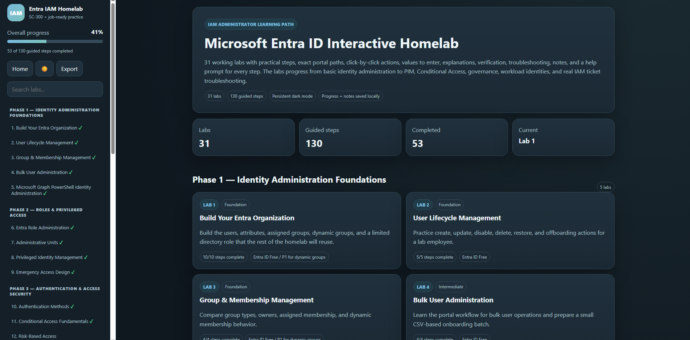

# Microsoft Entra ID Interactive Homelab

An interactive Microsoft Entra ID learning platform designed to provide hands-on IAM practice through guided labs that simulate real administrative tasks.

## Features

- 31 interactive Microsoft Entra ID labs
- 130 guided step-by-step exercises
- Progress tracking with local save
- Lab search and navigation
- Dark mode
- Notes for every lab
- Progress export and reset
- Troubleshooting guidance

## Topics Covered

- Microsoft Entra ID
- User & Group Management
- Role-Based Access Control (RBAC)
- Administrative Units
- Conditional Access
- Privileged Identity Management (PIM)
- Entitlement Management
- Identity Governance
- Microsoft Graph PowerShell
- SC-300 exam concepts

## Technologies

- HTML
- CSS
- JavaScript

---

This project was built as a personal learning platform to strengthen Microsoft Entra ID administration skills through hands-on practice and realistic IAM scenarios.
